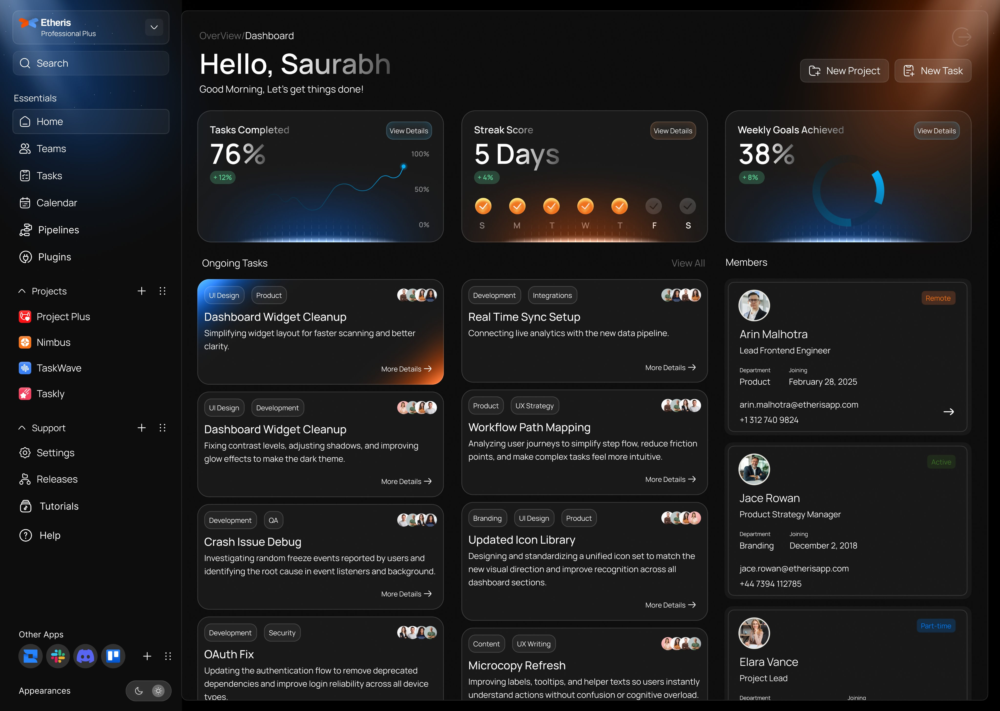

  

# Etheris Dashboard

Modern React + Vite dashboard showcasing analytics, team status, and task tracking with polished dark/light themes.

## Tech Stack
- React 19 + TypeScript
- Vite build tooling
- Tailwind-inspired utility classes
- Lucide icons & Recharts visualizations

## Getting Started
1. Install dependencies  
   `npm install`
2. Run the dev server  
   `npm run dev`
3. Build for production  
   `npm run build`

## Deployment
Deploy the `dist/` output (or let your host run the build step) so the compiled assets are served instead of raw TypeScript. Vercel works out of the box with the default `npm run build` command.
